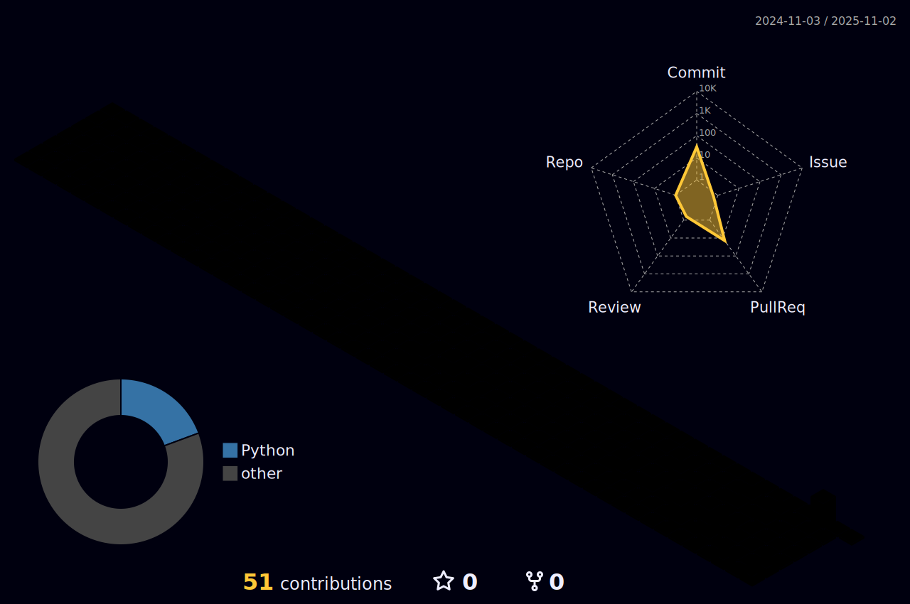

## 🚧 大工事中 🚧

  <!-- Metrics 基本情報 -->
  <picture>
    <source media="(prefers-color-scheme: dark)" srcset="output/metrics.base.svg" width="400" />
    <source media="(prefers-color-scheme: light)" srcset="output/metrics.base.svg" width="400" />
    
  </picture>

  <!-- Metrics 詳細 -->
  <picture>
    <source media="(prefers-color-scheme: dark)" srcset="output/details.svg" width="400" />
    <source media="(prefers-color-scheme: light)" srcset="output/details.svg" width="400" />
    
  </picture>

  <!-- 3D Contribution Graph -->
  <picture>
    <source media="(prefers-color-scheme: dark)" srcset="profile-3d-contrib/profile-night-rainbow.svg" width="700" />
    <source media="(prefers-color-scheme: light)" srcset="profile-3d-contrib/profile-season-animate.svg" width="700" />
    
  </picture>

---

## 📊 Stats

